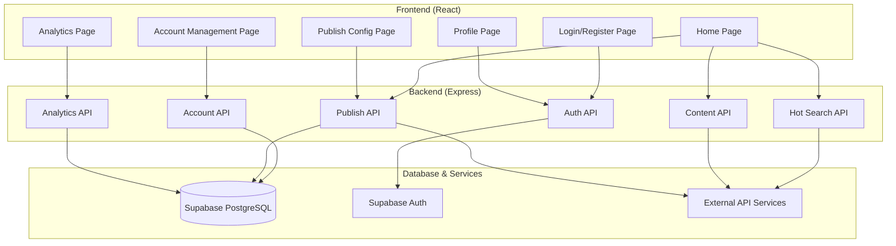
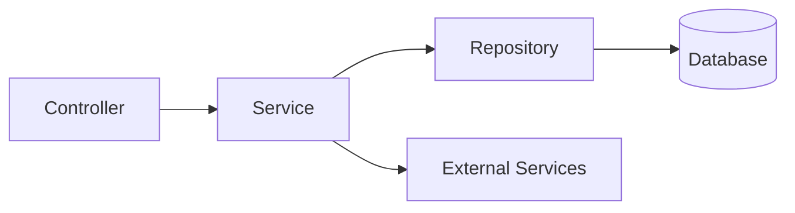
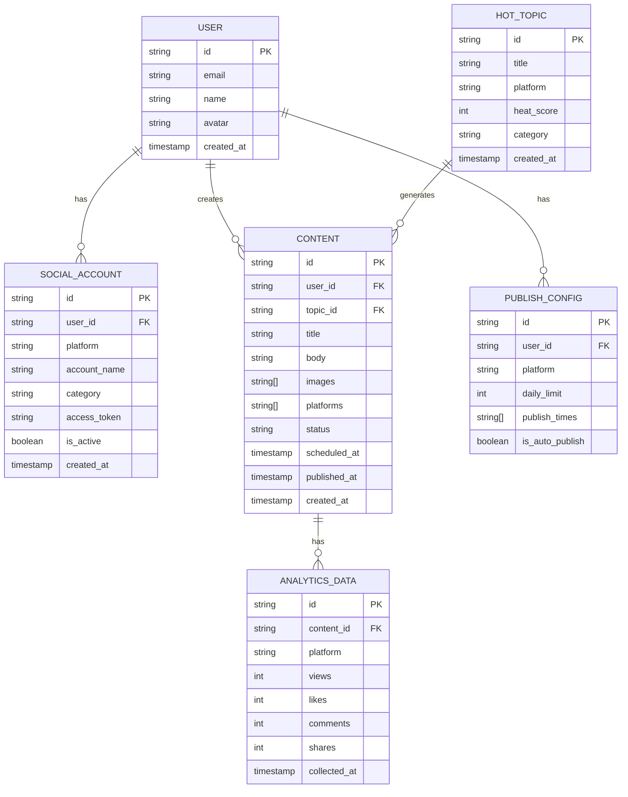

## 1. Architecture Design



## 2. Technology Description
- **Frontend**: React@18 + TypeScript + Tailwind CSS@3 + Vite + React Router + Zustand
- **Backend**: Express@4 + TypeScript
- **Database**: Supabase (PostgreSQL)
- **Authentication**: Supabase Auth
- **Charts**: Recharts
- **Icons**: Lucide React
- **HTTP Client**: Axios

## 3. Route Definitions
| Route | Purpose |
|-------|---------|
| / | 登录页（未登录）/ 首页（已登录） |
| /login | 登录页 |
| /register | 注册页 |
| /dashboard | 首页/仪表盘 |
| /accounts | 账号管理页 |
| /publish-config | 发布配置页 |
| /analytics | 数据统计页 |
| /profile | 个人中心页 |

## 4. API Definitions

### 4.1 Type Definitions
```typescript
// User
interface User {
  id: string;
  email: string;
  name: string;
  avatar?: string;
  createdAt: string;
}

// Social Account
interface SocialAccount {
  id: string;
  userId: string;
  platform: 'xiaohongshu' | 'douyin' | 'weibo';
  accountName: string;
  category: string; // 宝妈、科技、金融等
  accessToken: string;
  isActive: boolean;
  createdAt: string;
}

// Hot Topic
interface HotTopic {
  id: string;
  title: string;
  platform: string;
  heatScore: number;
  category: string;
  createdAt: string;
}

// Content
interface Content {
  id: string;
  userId: string;
  topicId?: string;
  title: string;
  body: string;
  images?: string[];
  platforms: string[];
  status: 'draft' | 'scheduled' | 'published' | 'failed';
  scheduledAt?: string;
  publishedAt?: string;
  createdAt: string;
}

// Publish Config
interface PublishConfig {
  id: string;
  userId: string;
  platform: string;
  dailyLimit: number;
  publishTimes: string[]; // e.g., ["09:00", "14:00", "20:00"]
  isAutoPublish: boolean;
}

// Analytics
interface AnalyticsData {
  id: string;
  contentId: string;
  platform: string;
  views: number;
  likes: number;
  comments: number;
  shares: number;
  collectedAt: string;
}
```

### 4.2 API Endpoints
- `POST /api/auth/login` - 用户登录
- `POST /api/auth/register` - 用户注册
- `GET /api/auth/me` - 获取当前用户信息
- `GET /api/hot-topics` - 获取今日热点
- `POST /api/content/generate` - AI生成内容
- `GET /api/accounts` - 获取社交账号列表
- `POST /api/accounts` - 添加社交账号
- `PUT /api/accounts/:id` - 更新社交账号
- `DELETE /api/accounts/:id` - 删除社交账号
- `GET /api/publish-config` - 获取发布配置
- `PUT /api/publish-config` - 更新发布配置
- `POST /api/publish` - 发布内容
- `GET /api/analytics` - 获取统计数据

## 5. Server Architecture Diagram



## 6. Data Model

### 6.1 Data Model Definition



### 6.2 Data Definition Language

```sql
-- Enable UUID extension
CREATE EXTENSION IF NOT EXISTS "uuid-ossp";

-- Users table (managed by Supabase Auth)
-- auth.users table exists by default

-- Social accounts table
CREATE TABLE social_accounts (
    id UUID PRIMARY KEY DEFAULT uuid_generate_v4(),
    user_id UUID REFERENCES auth.users(id) ON DELETE CASCADE NOT NULL,
    platform VARCHAR(50) NOT NULL,
    account_name VARCHAR(100) NOT NULL,
    category VARCHAR(50),
    access_token TEXT,
    is_active BOOLEAN DEFAULT TRUE,
    created_at TIMESTAMPTZ DEFAULT NOW()
);

-- Hot topics table
CREATE TABLE hot_topics (
    id UUID PRIMARY KEY DEFAULT uuid_generate_v4(),
    title TEXT NOT NULL,
    platform VARCHAR(50),
    heat_score INTEGER DEFAULT 0,
    category VARCHAR(50),
    created_at TIMESTAMPTZ DEFAULT NOW()
);

-- Content table
CREATE TABLE contents (
    id UUID PRIMARY KEY DEFAULT uuid_generate_v4(),
    user_id UUID REFERENCES auth.users(id) ON DELETE CASCADE NOT NULL,
    topic_id UUID REFERENCES hot_topics(id),
    title TEXT NOT NULL,
    body TEXT NOT NULL,
    images TEXT[],
    platforms TEXT[],
    status VARCHAR(20) DEFAULT 'draft',
    scheduled_at TIMESTAMPTZ,
    published_at TIMESTAMPTZ,
    created_at TIMESTAMPTZ DEFAULT NOW()
);

-- Publish config table
CREATE TABLE publish_configs (
    id UUID PRIMARY KEY DEFAULT uuid_generate_v4(),
    user_id UUID REFERENCES auth.users(id) ON DELETE CASCADE NOT NULL,
    platform VARCHAR(50) NOT NULL,
    daily_limit INTEGER DEFAULT 3,
    publish_times TEXT[],
    is_auto_publish BOOLEAN DEFAULT FALSE,
    UNIQUE(user_id, platform)
);

-- Analytics data table
CREATE TABLE analytics_data (
    id UUID PRIMARY KEY DEFAULT uuid_generate_v4(),
    content_id UUID REFERENCES contents(id) ON DELETE CASCADE NOT NULL,
    platform VARCHAR(50) NOT NULL,
    views INTEGER DEFAULT 0,
    likes INTEGER DEFAULT 0,
    comments INTEGER DEFAULT 0,
    shares INTEGER DEFAULT 0,
    collected_at TIMESTAMPTZ DEFAULT NOW()
);

-- Enable Row Level Security
ALTER TABLE social_accounts ENABLE ROW LEVEL SECURITY;
ALTER TABLE contents ENABLE ROW LEVEL SECURITY;
ALTER TABLE publish_configs ENABLE ROW LEVEL SECURITY;
ALTER TABLE analytics_data ENABLE ROW LEVEL SECURITY;

-- Create RLS policies
CREATE POLICY "Users can manage their own social accounts"
    ON social_accounts
    FOR ALL
    USING (auth.uid() = user_id)
    WITH CHECK (auth.uid() = user_id);

CREATE POLICY "Users can manage their own content"
    ON contents
    FOR ALL
    USING (auth.uid() = user_id)
    WITH CHECK (auth.uid() = user_id);

CREATE POLICY "Users can manage their own publish configs"
    ON publish_configs
    FOR ALL
    USING (auth.uid() = user_id)
    WITH CHECK (auth.uid() = user_id);

CREATE POLICY "Users can view their own analytics"
    ON analytics_data
    FOR SELECT
    USING (
        EXISTS (
            SELECT 1 FROM contents
            WHERE contents.id = analytics_data.content_id
            AND contents.user_id = auth.uid()
        )
    );

-- Grant permissions
GRANT SELECT ON hot_topics TO anon, authenticated;
GRANT ALL PRIVILEGES ON social_accounts TO authenticated;
GRANT ALL PRIVILEGES ON contents TO authenticated;
GRANT ALL PRIVILEGES ON publish_configs TO authenticated;
GRANT SELECT, INSERT ON analytics_data TO authenticated;

-- Insert sample hot topics
INSERT INTO hot_topics (title, platform, heat_score, category) VALUES
('AI技术最新突破', 'tech', 9800, '科技'),
('育儿技巧分享', 'xiaohongshu', 7600, '宝妈'),
('股市行情分析', 'weibo', 8500, '金融'),
('健康饮食指南', 'douyin', 6200, '生活'),
('旅行推荐攻略', 'xiaohongshu', 5800, '旅行');
```
