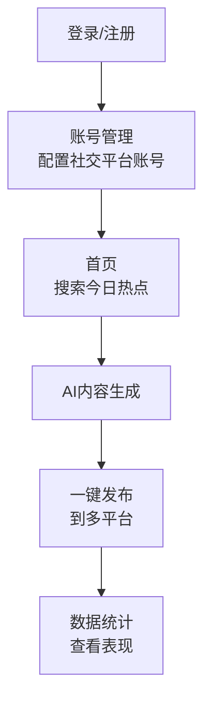

## 1. Product Overview
多社交媒体自动发布工具，帮助用户管理多个自媒体账号，自动搜索热点并一键AI生成内容发布到小红书、抖音、微博等平台
- 解决内容创作者跨平台发布繁琐的问题，提升内容生产和发布效率
- 目标用户：自媒体运营者、品牌营销人员、内容创作者

## 2. Core Features

### 2.1 User Roles
| Role | Registration Method | Core Permissions |
|------|---------------------|------------------|
| 用户 | 邮箱/手机号注册 | 全功能使用权限 |

### 2.2 Feature Module
1. **登录/注册页**：用户账号验证与注册
2. **首页**：热点搜索、AI内容生成、一键发布
3. **账号管理页**：多社交平台账号配置
4. **发布配置页**：每日发帖数量、自动发布时间配置
5. **数据统计页**：平台阅读数、观看数、评论等数据展示
6. **个人中心页**：用户信息设置

### 2.3 Page Details
| Page Name | Module Name | Feature description |
|-----------|-------------|---------------------|
| 登录/注册页 | 登录模块 | 邮箱/手机号登录，密码重置 |
| 登录/注册页 | 注册模块 | 新用户注册，邮箱验证 |
| 首页 | 热点搜索模块 | 自动搜索今日热点，热点分类展示 |
| 首页 | AI内容生成模块 | 基于热点一键生成图文/视频内容 |
| 首页 | 一键发布模块 | 选择平台，一键发布内容 |
| 账号管理页 | 平台账号配置 | 添加/编辑/删除社交平台账号（小红书、抖音、微博等） |
| 账号管理页 | 多账号管理 | 管理不同领域账号（宝妈、科技、金融等） |
| 发布配置页 | 发帖数量配置 | 设置每日各平台发帖数量上限 |
| 发布配置页 | 发布时间配置 | 设置自动发布的时间策略 |
| 数据统计页 | 数据概览 | 各平台数据总览图表 |
| 数据统计页 | 详细数据 | 阅读数、观看数、评论等详细数据 |
| 个人中心页 | 用户信息 | 修改个人信息、密码 |

## 3. Core Process
用户登录 → 配置社交平台账号 → 搜索今日热点 → AI生成内容 → 一键发布到多平台 → 查看数据统计

## 4. User Interface Design
### 4.1 Design Style
- 主色调：深蓝色 (#1e40af) + 青绿色 (#06b6d4)
- 辅助色：浅灰色 (#f3f4f6) + 橙色 (#f97316)
- 按钮风格：圆角矩形，带有悬停和点击效果
- 字体：Noto Sans SC，标题加粗，正文清晰易读
- 布局风格：卡片式布局，响应式设计
- 图标风格：简约线性图标，来自Lucide React

### 4.2 Page Design Overview
| Page Name | Module Name | UI Elements |
|-----------|-------------|-------------|
| 首页 | 顶部导航 | 品牌logo，导航菜单，用户头像 |
| 首页 | 热点卡片 | 渐变背景，热点标题，热度指数，快速生成按钮 |
| 首页 | 内容编辑器 | 实时预览，平台选择，发布按钮 |
| 账号管理页 | 账号卡片 | 平台图标，账号信息，操作按钮 |
| 数据统计页 | 数据图表 | 折线图/柱状图展示数据趋势 |
| 数据统计页 | 统计卡片 | 关键指标卡片，带数字动画 |

### 4.3 Responsiveness
- 桌面端优先，自适应平板和移动端
- 触控优化，按钮尺寸适合点击
- 响应式网格布局

### 4.4 3D Scene Guidance
不涉及3D场景
